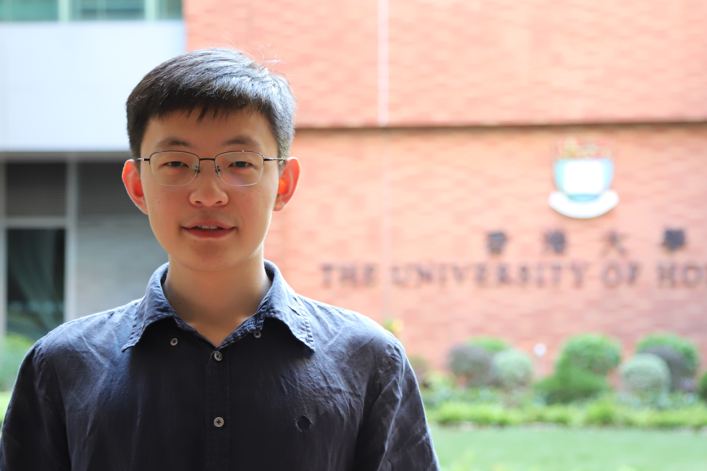

#### Xianhao Chen ####
Assistant Professor, The University of Hong Kong 
Email: xchen [at] eee.hku.hk

I am an assistant professor at [the Department of Electrical and Electronic Engineering, the University of Hong Kong](https://www.eee.hku.hk/), leading the <strong>W</strong>ireless <strong>I</strong>nformation & Inte<strong>ll</strong>igence (<strong>WILL</strong>) lab. I obtained my Ph.D. degree in electrical and computer engineering from the University of Florida in 2022, advised by [Prof. Yuguang Fang](http://www.fang.ece.ufl.edu/), and my B.Eng. degree from Southwest Jiaotong University, Chengdu, China, in 2017. My research interests include wireless networks, edge computing, distributed learning, and network security.

<!--**If you are interested in working with me as a Ph.D. student/research assistant, please feel free to drop me an email including your CV, transcript, and sample publications (if any).** Due to the volume of email inquiries, I may only be able to contact shortlisted candidates (usually within one week). Thanks for your understanding. -->

#### Research Interests ####
Machine learning (ML) and computing are the enablers for all of today's intelligent applications. However, with the collection of massive data, the exponential increase in AI model sizes, and the pervasiveness of smart applications, ML and computing cannot continue to strive if there are no effective communication networks to support them with high efficiency, ultra-low latency, and good data privacy. For this reason, 5G/6G is expected to be no longer just for information delivery, but rather serve as an integrated communication and computing platform to “intelligentize” everything. In response to this observation, we will explore various research problems in next-generation mobile networks, particularly the co-design of wireless communications and computing/AI.

- Wireless communications/networking for computing/machine learning
  - Mobile edge computing
  - Edge intelligence (e.g., edge federated/split learning and edge inference)
  - Cooperative perception in connected and autonomous vehicles

- Machine learning for wireless communications/networking
  - Reinforcement learning for network optimization
 
- Security and privacy in distributed learning
  - Attack/defense techniques in federated/split learning

#### Awards ####
- 2023 IEEE ICCC Best Paper Award
- 2022 ECE Graduate Excellence Award in Research, the University of Florida

#### Services ####
- Associate Editor, ACM Computing Surveys

